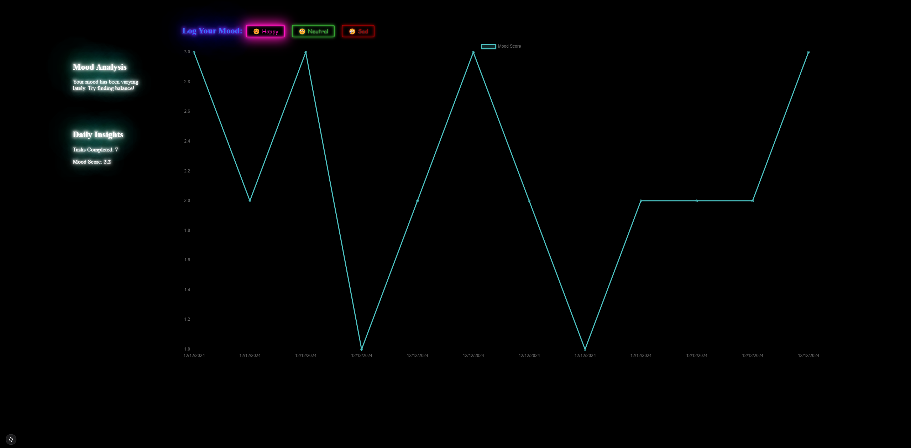

### App overview

Created using Next.js with TypeScript (standard template)

### Main components

1. Mood Analysis - displays the current mood of the user, based on the user mood input.
2. Mood Tracker - provides the ability for user to input his current mood.
3. Daily insight summary - shows completed tasks (random integer as per requirements) and the mood score - calculated dynamically depending on the mood's data.
4. Bar chart - reacts on user mood input and displays a chart of the score and date.

### Screenshots



### Running locally

```console
$ cd <project_directory>
$ npm install
$ npm run dev # dev mode
```

Or for production build:

```console
$ npm run build
$ npm start
```

### Explanation of any assumptions or logic decisions made

I've used React 18 (not latest) to be compatible with react-chartjs-2. Also the project uses Turbopack
